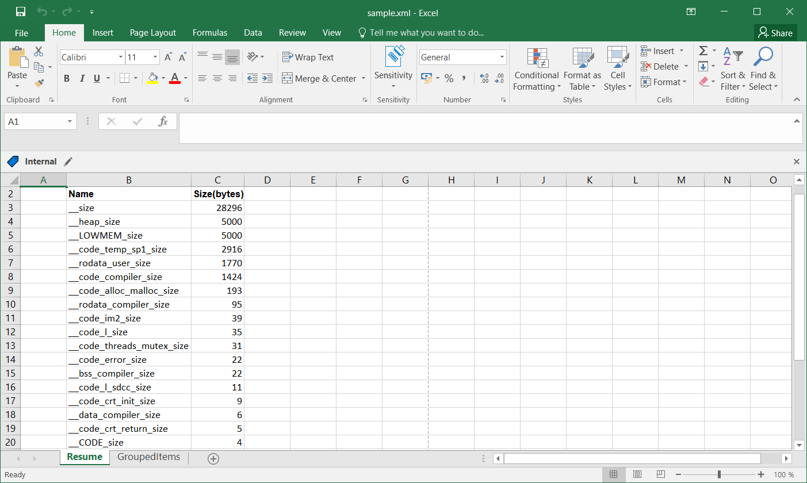
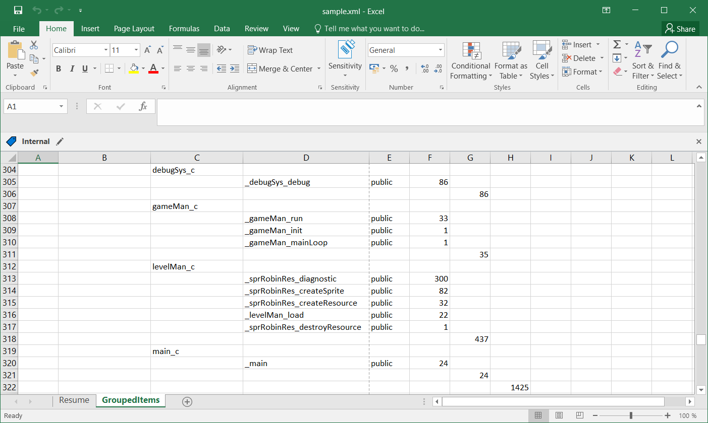

# zmemmap
Z88DK tool to parse and interpret the memory map files.  
The result is an Excel report with detailed information about your memory map file.
  
  
Here you can find an example:

- this is the resume tab  

- this is the Grouped-Items tab    

